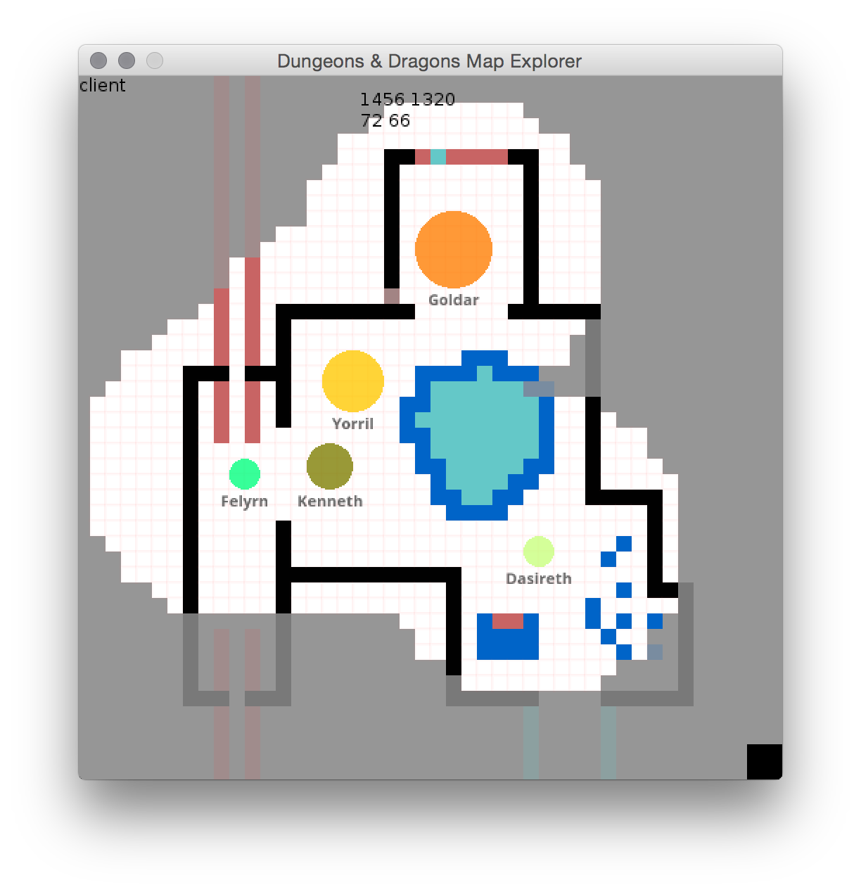

#D&D Map Creator
####_Build quality D&D Battlemaps on-the-fly!_

###**[Have a feature request or bugs to report? Just want to give me some general feedback or suggestions? Click me :)](https://docs.google.com/forms/d/1NDoWgFsHUcWuL70Hhc727EPv5_jaKcxm8cFkjT5O3KQ/viewform)**

##Installation
The easiest way to install this software:

- Download the source
- Install [LÖVE](https://love2d.org)
- OS X and Linux
 - On the command-line, run `/path/to/love Dnd-Map-Explorer/`
- Windows
 - Drag the whole folder `/DnD-Map-Explorer` onto your love executable

##Documentation

###Controls

_**Key** - Function_

####Drawing/Erasing
- _**C** - Previous color_
- _**V** - Next color_
- _**D** - Hold down to draw with currently selected color_
- _**E** - Hold down to erase_
- _**J** - Hit twice to draw filled rectangle with currently selected color, once to choose first corner and again to choose opposite corner_
- _**K** - Hit twice to draw outlined rectangle with currently selected color, once to choose first corner and again to choose opposite corner_
- _**L** - Hit twice to draw line with currently selected color, once to choose begin point, again to choose end point_
- _**N** - Clear the grid_
- _**R-Shift** - Toggle fog editing_
- _**L-Shift** - Hold and move mouse to the edge of the screen to pan the camera_

####Grid Functions
- _**G** - Toggle gridlines_
- _**A** - Load a map, continue pressing to cycle through available maps. Press **Return** to load the selected map_
- _**S** - Save the current map to a file_
- _**-** - Zoom out_
- _**=** - Zoom in_

####Token Functions
- _**T** - Open new token dialog_
- _**Y** - Open token edit/delete dialog_
- _**M** - Toggle token snapping-to-grid_

####Network Functions
- _**B** - Connects to the server (if in Client mode)_

NOTE: To start a server, do the following:
 - On OS X or Linux, run the following in Terminal: `path/to/love DnD-Map-Explorer/ 1` (1 being the argument that enables server mode)
 - On Windows, change the line in `main.lua` from `Network = Network('localhost', 9999, tonumber(args[2]) or 0)` to `Network = Network('localhost', 9999, 1)` then run the game as you normally would. 
 
If a client is opened when a server is running, as long as both machines are on the same network, it should automatically connect to the server. If a server is opened after the client, press **B** on the client to connect. The server's screen should become tinted red to indicate connection.
	